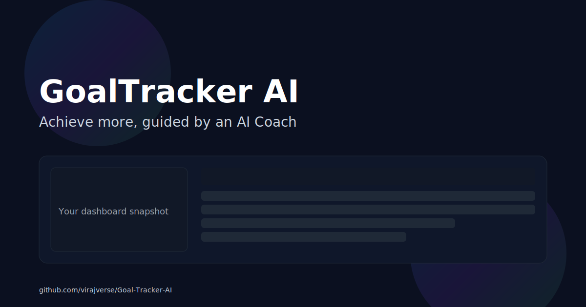
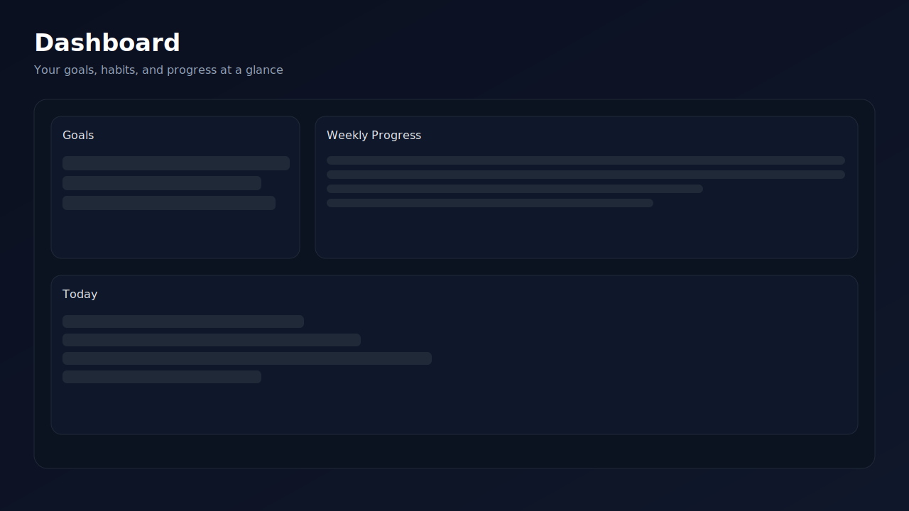
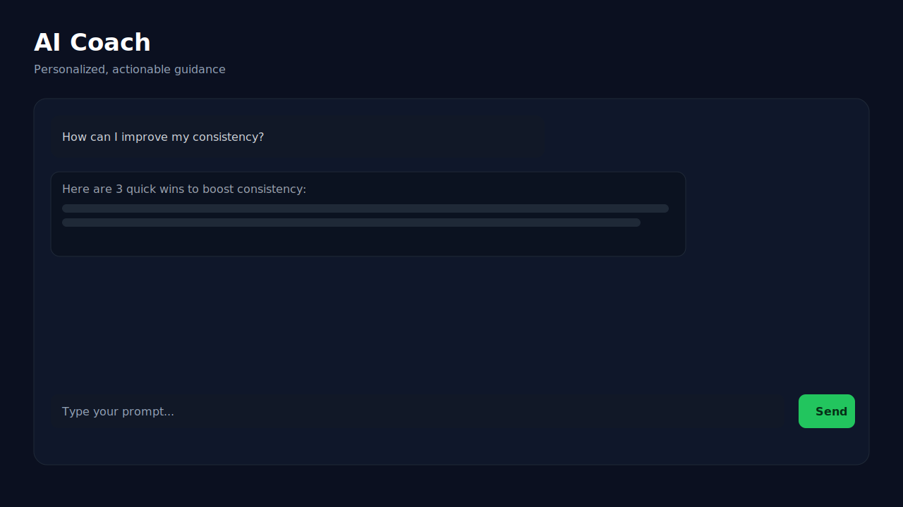
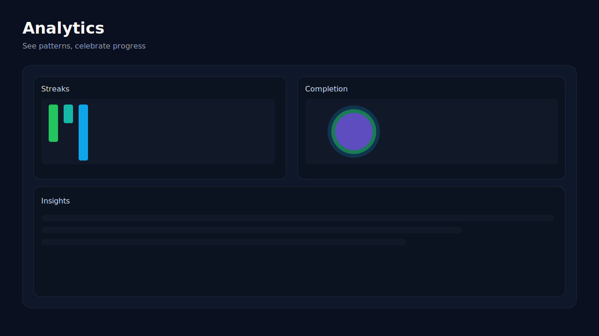

<div align="center">



<h1>GoalTracker AI</h1>
<p><strong>Achieve more, guided by an AI Coach.</strong> Plan better, track smarter, and stay consistent with an elegant Next.js app powered by Gemini + Supabase.</p>

<p>
  <a href="https://github.com/virajverse/Goal-Tracker-AI"></a>
  <a href="LICENSE"></a>
  
  
  
  
  
  
  
  
</p>

<p>
  <a href="#-project-overview">Overview</a> ·
  <a href="#-screenshots--demo">Screenshots</a> ·
  <a href="#-tech-stack">Tech Stack</a> ·
  <a href="#-installation">Install</a> ·
  <a href="#-usage-examples">Usage</a> ·
  <a href="#-features">Features</a> ·
  <a href="#-folder-structure">Structure</a> ·
  <a href="#-contributing">Contributing</a> ·
  <a href="#-license">License</a> ·
  <a href="#-contact">Contact</a>
</p>

</div>

## 🚀 Project Overview

GoalTracker AI is your personal productivity copilot. It combines a clean goal dashboard, habit tracking, and analytics with an AI Coach that offers concise, actionable guidance. Built with Next.js 15 and React 19, it uses Supabase for data and Google Gemini for smart suggestions.

Why it’s different:
- **AI-first UX**: Ask in plain language. Get practical steps, not fluff.
- **Real-time insights**: Progress, streaks, and analytics that motivate you.
- **Privacy-conscious**: Uses secure server routes and HTTP-only cookies.

## 🎥 Screenshots / Demo

> Live Demo: Coming Soon

| Cover | Dashboard |
|---|---|
|  |  |

| AI Coach | Analytics |
|---|---|
|  |  |

## ⚙️ Tech Stack

- ⚡ Next.js 15, React 19, TypeScript 5
- 🎨 Tailwind CSS 3 (+ Typography)
- 🛢️ Supabase (Auth, DB, Storage)
- 🤖 Google Gemini + OpenAI (optional)
- 🔒 HTTP-only JWT session cookies

Quick badges:


## 📦 Installation

Prerequisites:
- Node.js 18+
- A Supabase project (URL + anon key)
- A Google AI Studio API key (Gemini)

Steps:

```bash
git clone https://github.com/virajverse/Goal-Tracker-AI.git
cd Goal-Tracker-AI
npm install

# Copy and fill environment variables
cp .env.example .env.local
# Edit .env.local with your keys (Supabase, Gemini, etc.)

# Start dev server
npm run dev
```

More details: see `supabase-setup-guide.md` and `quick-setup-steps.md`.

## 🧪 Usage Examples

Client example – call the AI route to get suggestions:

```ts
// POST /api/ai
await fetch("/api/ai", {
  method: "POST",
  headers: { "Content-Type": "application/json" },
  body: JSON.stringify({
    prompt: "Share 3 quick tips to build a morning routine",
    model: "gemini-1.5-flash-001",
    fallbacks: ["gemini-1.5-pro-001", "gemini-1.0-pro"],
  }),
});
```

List available Gemini models (server route):

```http
GET /api/ai/models
```

Auth endpoints (examples):
- `POST /api/auth/signup`
- `POST /api/auth/login`
- `POST /api/auth/logout`
- `GET /api/auth/me`

## ✨ Features

- ✔️ AI Coach with concise, practical answers
- ✔️ Goals, daily logs, and habit tracking
- ✔️ Rich analytics: streaks, completion, insights
- ✔️ Dark UI with Tailwind Typography
- ✔️ Secure auth via HTTP-only cookies
- ✔️ Environment-driven model selection + fallbacks

## 🗂️ Folder Structure

```text
Goal-Tracker-AI/
├─ app/                      # Next.js App Router (routes, API)
├─ src/                      # Libraries, UI components, helpers
│  └─ lib/                   # AI, config, auth utils
├─ docs/                     # README images (SVG placeholders)
│  ├─ cover.svg
│  ├─ screenshot-dashboard.svg
│  ├─ screenshot-ai.svg
│  └─ screenshot-analytics.svg
├─ public/                   # Static assets
├─ migrations/               # SQL migrations
├─ middleware.ts             # Auth/session middleware
├─ tailwind.config.js        # Tailwind setup
├─ postcss.config.js         # PostCSS plugins
├─ next.config.mjs           # Next.js config
├─ tsconfig.json             # TypeScript config + @/* alias
├─ .env.example              # Example env vars
├─ .env.local                # Local secrets (gitignored)
├─ LICENSE                   # MIT
└─ README.md
```

## 🤝 Contributing

Contributions are welcome!

1. Fork the repo and create a feature branch:
   ```bash
   git checkout -b feat/cool-improvement
   ```
2. Commit with clear messages and add tests where relevant.
3. Open a Pull Request with a descriptive summary and screenshots.

Before submitting, please:
- Run `npm run lint` and fix issues
- Ensure `npm run build` works

## 📄 License

This project is licensed under the **MIT License** — see [`LICENSE`](LICENSE).

## 👤 Contact

- GitHub: [@virajverse](https://github.com/virajverse)
- Issues: [Open a bug/feature request](https://github.com/virajverse/Goal-Tracker-AI/issues)
- LinkedIn / Website: Add your links here ✨

---

If this project helps you, consider ⭐ starring the repo and sharing feedback! 
